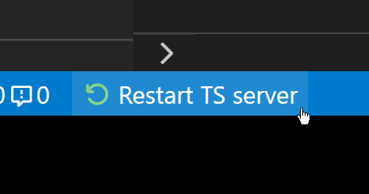

# Restart TS server Status Bar button

The TypeScript Language Server becomes slow over long period of usage and sometimes gets stuck when changing files outside of VS Code (eg. changing git branches). This extension adds a convenient _Restart TS server_ button to the Status Bar which allows you to quickly restart the TS server:

Availability:
* **VS Code Marketplace:** https://marketplace.visualstudio.com/items?itemName=qcz.restart-ts-server-button
* **OpenVSX:** https://open-vsx.org/extension/qcz/restart-ts-server-button

## Requirements

The extension requires at least Visual Studio Code 1.41 and the TypeScript Language Features extension (which is installed by default).

## License

MIT

## My other extensions
* **Text Power Tools** – All-in-one solution with 140+ commands for text manipulation: [VS Code Marketplace](https://marketplace.visualstudio.com/items?itemName=qcz.text-power-tools) / [OpenVSX](https://open-vsx.org/extension/qcz/text-power-tools)
